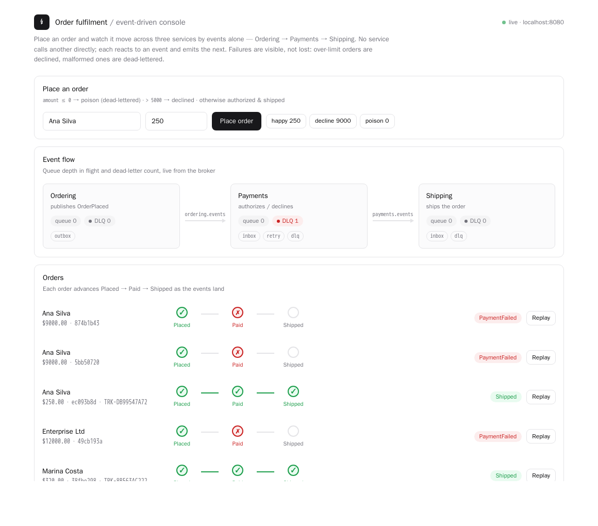
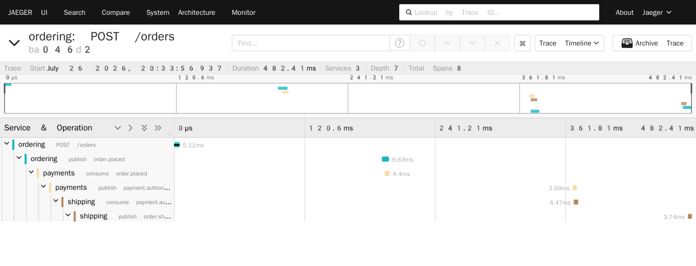

# Event-Driven .NET Reference Architecture

> Reliable messaging between services in .NET — the outbox, idempotent consumers, retry and
> dead-lettering, and sagas. Documented first, implemented in the open.

[](./ROADMAP.md)
[](./docs/adr)
[](./LICENSE)

Publishing a message from .NET takes five lines. Publishing it *reliably* — so that it is
never lost when the database commits and the broker call fails, never processed twice when
the consumer crashes after handling but before acknowledging, and never silently discarded
after a poison message — is the actual work. That gap is where most event-driven systems
fail in production, usually months after launch and always at the worst possible time.

This repository documents the decisions that close that gap, and then builds a working
reference implementation on top of them.

**Português:** [README.pt-BR.md](./README.pt-BR.md)

---

## What is here today

| Area | Status | Link |
| --- | --- | --- |
| Context & scope | Done | [docs/context.md](./docs/context.md) |
| C4 diagrams and message flows | Done | [docs/diagrams](./docs/diagrams) |
| Architecture Decision Records | 5 published | [docs/adr](./docs/adr) |
| Quality attributes & trade-offs | Done | [docs/quality-attributes.md](./docs/quality-attributes.md) |
| Reliability spine (outbox, inbox, retry/DLQ) | Done — Phase 3 | [Run it locally](#run-it-locally) · [src](./src) |
| Resilience & operations (chaos, tracing, load) | Done — Phase 4 | [Resilience](#resilience-under-failure) · [Observability](#observability-and-performance) · [runbooks](./docs/runbooks.md) |

## The four problems this architecture solves

| Problem | What goes wrong | Addressed by |
| --- | --- | --- |
| **Dual write** | The transaction commits, the publish fails, the message is lost forever | [ADR-0003 — Transactional outbox](./docs/adr/0003-transactional-outbox.md) |
| **Duplicate delivery** | At-least-once delivery means every consumer will eventually see the same message twice | [ADR-0004 — Idempotent consumers](./docs/adr/0004-idempotent-consumers.md) |
| **Poison messages** | One unprocessable message blocks the queue, or is dropped without trace | [ADR-0005 — Retry and dead-lettering](./docs/adr/0005-retry-and-dead-lettering.md) |
| **Coupled topology** | Adding a consumer requires changing the producer | [ADR-0002 — Topology](./docs/adr/0002-messaging-topology.md) |

## Run it locally

`docker compose up` brings up RabbitMQ, PostgreSQL, and three services; each creates its own schema
on start.

```bash
make up        # RabbitMQ + PostgreSQL + Jaeger + Ordering (API :8080) + Payments + Shipping
make demo      # place orders and watch them flow: happy path, decline, poison/DLQ, replay
make chaos     # kill broker/consumer/database mid-flight; assert no loss + exactly-once
make loadtest  # ingest throughput and latency percentiles
make down      # stop everything
```

Open **[localhost:8080](http://localhost:8080)** for a live console: place an order and watch it move
across the three services, with each service's queue depth and dead-letter count read live from the
broker. Below — a shipped order, two declines, and a malformed order dead-lettered (Payments `DLQ 1`).



`make demo` exercises the reliability spine end to end:

- an order flows **Placed → Paid → Shipped** across three services, carried only by events;
- an over-limit order ends **PaymentFailed** — a business decline, published as an event, not a failure;
- a malformed order is **dead-lettered on the first attempt** (a poison message), and the order is left untouched;
- **replaying** the same message — its stable `MessageId` re-dispatched — is **deduplicated by the inbox**, so the effect happens exactly once.

| Project | Role |
| --- | --- |
| [`Ordering`](./src/Ordering) | API + live console. Writes the order and `OrderPlaced` in one transaction (the outbox), and tracks status |
| [`Payments`](./src/Payments) | Idempotent consumer. Authorizes or declines; a malformed order is a poison message |
| [`Shipping`](./src/Shipping) | Idempotent consumer. Ships an authorized order and emits `OrderShipped` |
| [`EventDriven.Messaging`](./src/EventDriven.Messaging) | The reusable spine: outbox dispatcher, inbox dedup, topology, three-layer retry / DLQ |

No framework hides the pattern — the outbox, inbox, and retry ladder are written against
`RabbitMQ.Client` directly, on purpose: this repository teaches the mechanism rather than delegating
it. The RabbitMQ management UI is at [localhost:15672](http://localhost:15672) (guest / guest).

Deferred to keep this first cut coherent: the **saga host with compensation** (it depends on
ADR-0007, a Milestone 2 decision).

## Resilience under failure

The guarantees are only worth stating if they hold when things break. `make chaos` kills each moving
part while orders are in flight and asserts nothing is lost and the effect is exactly-once — one
command, one results table:

```
scenario                             placed   terminal   lost   verdict
----------------------------------------------------------------------------
baseline                                 10         10      0   PASS
kill broker (+place while down)          14         14      0   PASS
kill consumer                            10         10      0   PASS
kill database                            10         10      0   PASS
duplicate delivery (replay x3)            1  1 payment          PASS
poison -> DLQ (order stays Placed)        1   DLQ 5->6          PASS
exactly-once (no duplicate effects)                              PASS
```

- **Kill the broker** — orders placed *while it is down* wait durably in the outbox and flow once it
  returns ([ADR-0003](./docs/adr/0003-transactional-outbox.md)); unacked messages are redelivered and
  deduplicated.
- **Kill a consumer** — its durable queue holds the backlog; it drains on restart.
- **Kill the database** — in-flight transactions fail transiently and retry; no partial effects.
- **Exactly-once** is checked globally: one payment and one shipment per order, no duplicates, across
  every failure above ([ADR-0004](./docs/adr/0004-idempotent-consumers.md)).

Operating it is documented too: [runbooks](./docs/runbooks.md) for DLQ triage, replay, and backlog
recovery.

## Observability and performance

**One order is one trace, across the broker.** Every service is instrumented with OpenTelemetry; the
W3C trace context rides in each message's `traceparent` header, so an order's whole journey —
`POST /orders → publish → Payments consume → publish → Shipping consume → publish → Ordering updates
status` — is a single distributed trace. `make up` starts Jaeger; open [localhost:16686](http://localhost:16686).



**Performance** (`make loadtest`) separates the two things that matter in an async system — ingest is
fast because the outbox decouples it from the broker; end-to-end is the full three-hop journey:

| Metric | Value |
| --- | --- |
| Ingest throughput | **815 orders/s** (500 orders, 0 failed) |
| POST latency | p50 22 ms · p95 138 ms · p99 237 ms |
| End-to-end (place → shipped) | p50 ~1 s steady; higher under burst as backlog drains |

Full method and numbers in [docs/load-results.md](./docs/load-results.md).

## Why documented first

The failure modes above are cheap to design around and extremely expensive to retrofit. A
system that publishes without an outbox does not fail in testing — it fails under load, in
production, months later, and the loss is silent. Writing the decisions down first makes the
trade-offs reviewable before they are load-bearing.

Every decision is recorded as an ADR with its context, the options considered, and the
consequences accepted.

## Roadmap

Four phases, tracked as GitHub milestones. See [ROADMAP.md](./ROADMAP.md).

1. **Architecture** — context, diagrams, ADRs, quality attributes
2. **Contracts** — message schemas, versioning policy, saga definitions, failure catalogue
3. **Reference implementation** — publisher, consumers, outbox, saga host, Docker Compose
4. **Resilience & operations** — chaos tests, observability, runbooks, load testing

## Related

- [iot-realtime-ingestion](https://github.com/prodrigues2023/iot-realtime-ingestion) — the same messaging patterns at the high-throughput ingest edge: durable buffer, idempotent writes
- [k8s-observability-stack](https://github.com/prodrigues2023/k8s-observability-stack) — the tracing that follows an event across the broker, plus queue-depth and consumer-lag signals
- [rag-reference-architecture](https://github.com/prodrigues2023/rag-reference-architecture) — RAG on enterprise workloads
- [rag-evaluation-toolkit](https://github.com/prodrigues2023/rag-evaluation-toolkit) — measuring whether a RAG system works: metrics, golden datasets, judge calibration
- [ai-solution-architecture-kit](https://github.com/prodrigues2023/ai-solution-architecture-kit) — architecture governance artefacts: risk tiers, model certification, review checklists

## Author

Paulo Roberto Franco Rodrigues — Solutions Architect.
Twenty years in distributed systems; more than a decade designing asynchronous integration
with RabbitMQ and .NET, and Kubernetes platforms with the observability to operate them.
[LinkedIn](https://linkedin.com/in/paulo-roberto-franco-rodrigues)

## License

MIT — see [LICENSE](./LICENSE).
