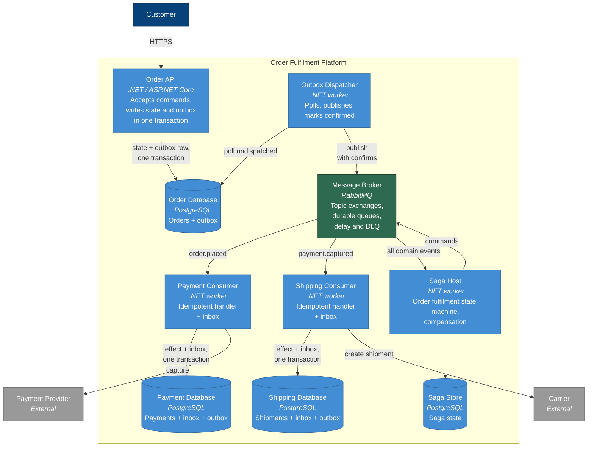

# C4 Level 2 — Containers

The deployable units and how messages move between them.

## Why these boundaries

**The dispatcher is separate from the API.** They have opposite profiles: the API is
latency-sensitive and scales with user traffic; the dispatcher is a steady background process
whose throughput depends on write volume, not on request volume. Running the dispatcher
inside the API process means every API instance polls the same table, and a scale-out event
multiplies the polling load for no benefit.

**Every service owns its database.** This is what makes the outbox work — the state change
and the outbox row are in the *same* database, so one transaction covers both. A shared
database would remove the dual-write problem by removing the service boundary, and with it the
reason for messaging.

**Every consumer has both an inbox and an outbox.** The inbox deduplicates what arrives; the
outbox reliably publishes what results. A consumer that produces events needs both, and the
symmetry is deliberate — it means one pattern, applied everywhere, rather than special cases.

**The saga is a separate host.** Saga state is long-lived and its failure mode is distinct: a
stuck saga is a business process that has silently stopped, which needs different monitoring
from a failed message. Separating it also keeps the coordination logic out of the services,
so a change to the process does not require redeploying payment and shipping.

**External calls happen inside consumers, not inside the API.** The payment provider is slow
and occasionally unavailable. Behind a queue, that is a backlog; in the request path, it is an
outage.

## Deployment notes

Everything runs locally through Docker Compose in Milestone 3. Managed equivalents — Container
Apps or ECS for workers, Amazon MQ or Azure Service Bus for the broker, managed PostgreSQL for
the stores — are documented alongside the implementation. Where Service Bus differs from
RabbitMQ in a way that affects the design, notably in its native delayed delivery, that is
recorded rather than abstracted away.
