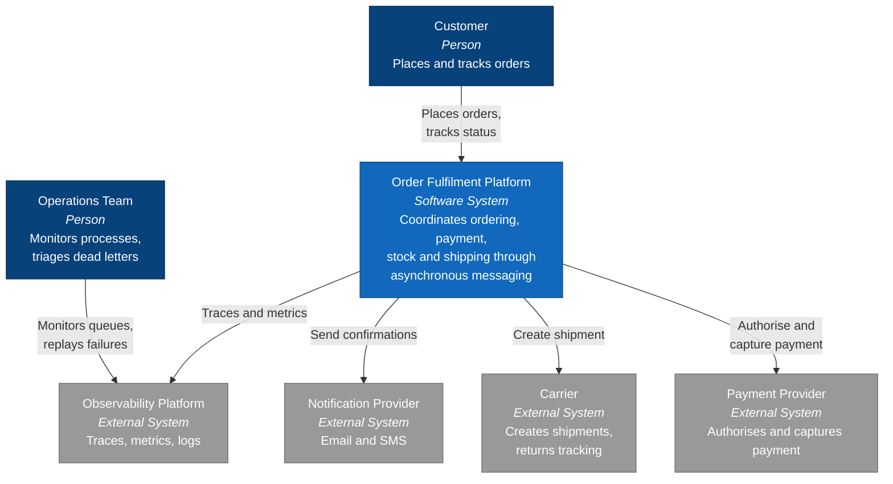

# C4 Level 1 — System Context

Who uses the system, and what it depends on.

## Notes

**The order fulfilment domain is a vehicle, not the point.** It is used because everyone
recognises it and because it naturally contains the hard cases: a payment that must not be
taken twice, a shipment that cannot be un-created, and a process that spans minutes rather
than milliseconds. The architecture is the deliverable.

**External calls are the reason idempotency matters.** Each of the three providers has an
effect that cannot be rolled back by a database transaction. A duplicate message that reaches
the payment provider takes the money twice, and no amount of transactional discipline inside
the platform prevents that — see [ADR-0004](../adr/0004-idempotent-consumers.md).

**Operations is a first-class user.** A messaging architecture that cannot be diagnosed and
replayed by a person at 3am is not finished, regardless of how correct it is on paper. This is
why the dead-letter queue carries diagnostic headers and why replay is a designed operation
rather than an emergency improvisation.
