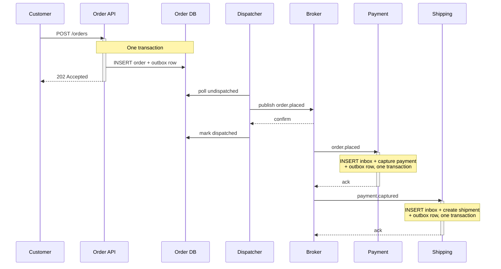
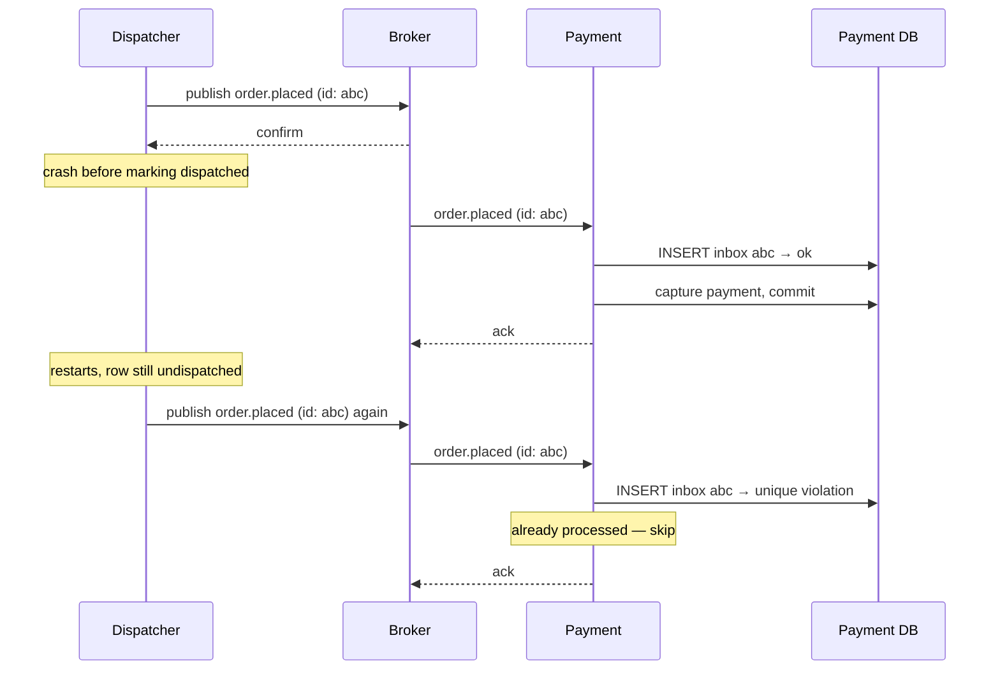
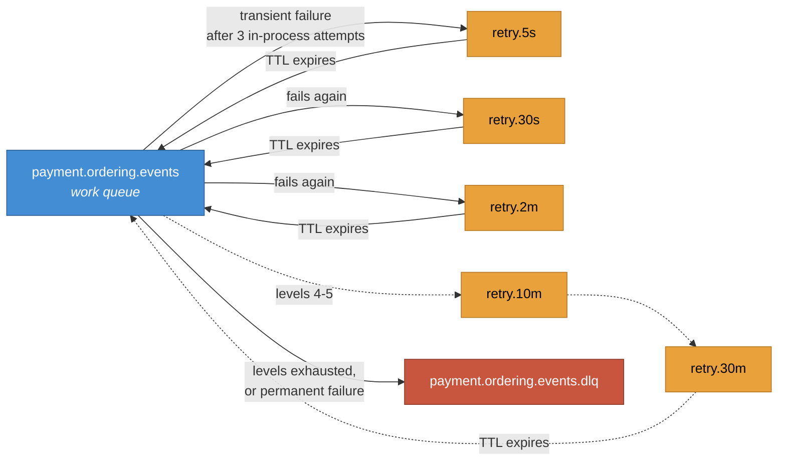
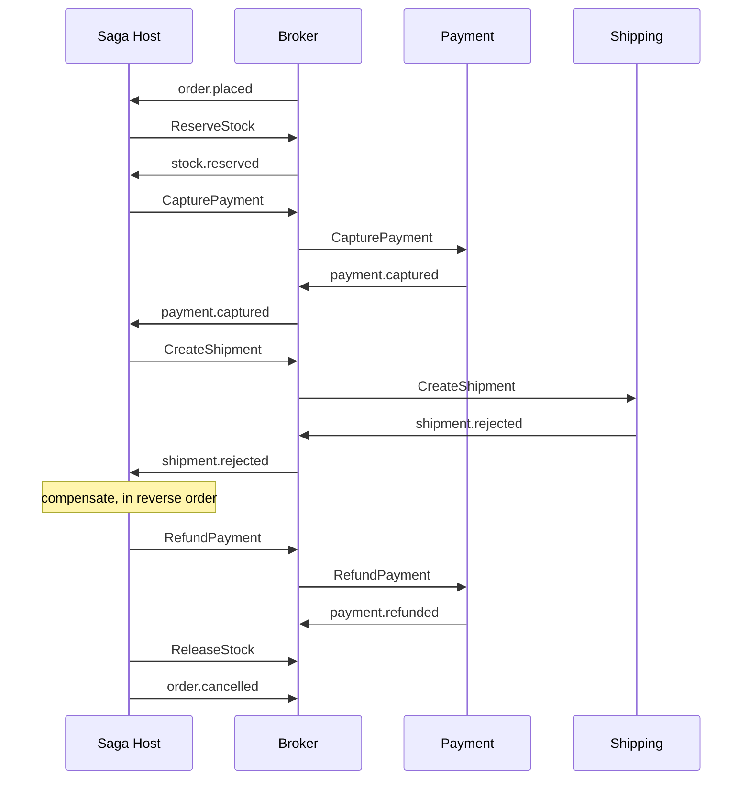

# Message flows

The four flows worth drawing. The happy path is the one everybody draws; the other three are
where the architecture earns its keep.

---

## 1. Happy path — order to shipment

The API returns `202 Accepted`, not `201 Created`. The order exists; the process has not
finished. Returning a status that implies completion is the most common way an event-driven
API lies to its clients.

---

## 2. Duplicate delivery

The dispatcher crashed after the broker confirmed but before marking the row dispatched. On
restart it publishes the same message again.

The message id is assigned once, at outbox insertion. A redelivery is the *same* message, not
a new one — which is why a producer that generates a fresh id per attempt silently defeats the
whole mechanism. See [ADR-0004](../adr/0004-idempotent-consumers.md).

---

## 3. Retry and dead-lettering

A message that fails validation goes straight to the DLQ — no retry ladder. Retrying a
malformed payload for 43 minutes accomplishes nothing except delaying the alert. See
[ADR-0005](../adr/0005-retry-and-dead-lettering.md).

---

## 4. Saga compensation

Payment succeeded, the carrier rejected the shipment. The payment must be reversed.

**Compensation is not rollback.** The payment was really taken and is really refunded — two
transactions, both visible to the customer and to the payment provider, not one undone. This
matters for the design of the business process, not only for the code: some steps cannot be
compensated at all. An email cannot be unsent. Those steps go last, which means the saga
constrains how the business process itself is ordered.

Saga state and the choice between orchestration and choreography are covered in ADR-0007 —
see [ROADMAP.md](../../ROADMAP.md), Milestone 2.
