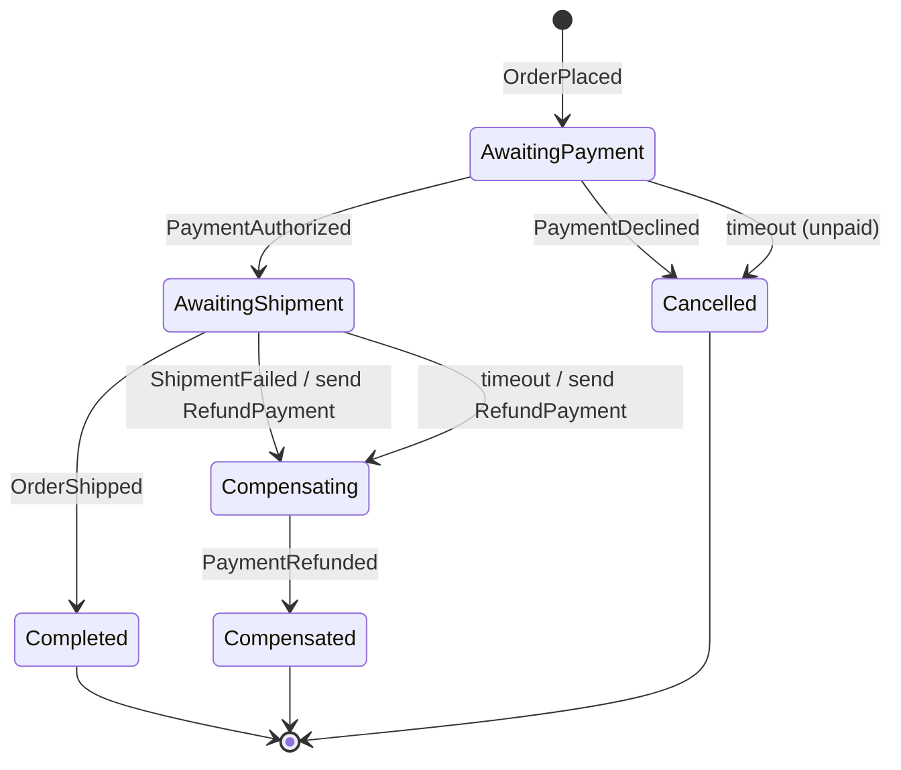

# Order-fulfilment saga

The orchestrated saga ([ADR-0007](../adr/0007-saga-vs-process-manager.md)) that lives in the Ordering
service. It advances on the events it observes, and on a shipment failure it compensates the completed
payment with a `RefundPayment` command.

## The states

| State | Meaning | Order status |
| --- | --- | --- |
| `AwaitingPayment` | The order is placed; waiting for Payments. | `Placed` |
| `AwaitingShipment` | Payment authorized (its id is recorded for a possible refund); waiting for Shipping. | `Paid` |
| `Completed` | Shipped. Terminal, happy. | `Shipped` |
| `Cancelled` | Payment declined. Terminal; nothing to compensate — no money moved. | `PaymentFailed` |
| `Compensating` | Shipping failed after payment; a `RefundPayment` command is in flight. | `Compensating` |
| `Compensated` | The refund completed. Terminal; a consistent business state was restored. | `Cancelled` |

## Why compensation is a command, not an event

`RefundPayment` is a directed instruction to exactly one handler — Payments — so it is a command
([ADR-0002](../adr/0002-messaging-topology.md)), routed to Payments' own queue. It rides the same
outbox and inbox as everything else, so it is delivered at-least-once and applied exactly once: a
redelivered refund refunds once.

## Timeouts

A waiting state has a deadline (`SAGA_TIMEOUT_SECONDS`, default 20). A `SagaTimeoutMonitor` sweeps for
sagas held past it and fires the timeout: `AwaitingPayment` is cancelled (nothing was charged), and
`AwaitingShipment` is compensated with the same `RefundPayment` command as a shipment failure — so a
never-arriving outcome does not strand a saga. See [ADR-0007](../adr/0007-saga-vs-process-manager.md).
